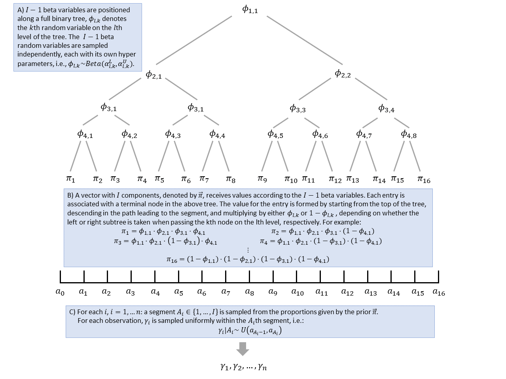
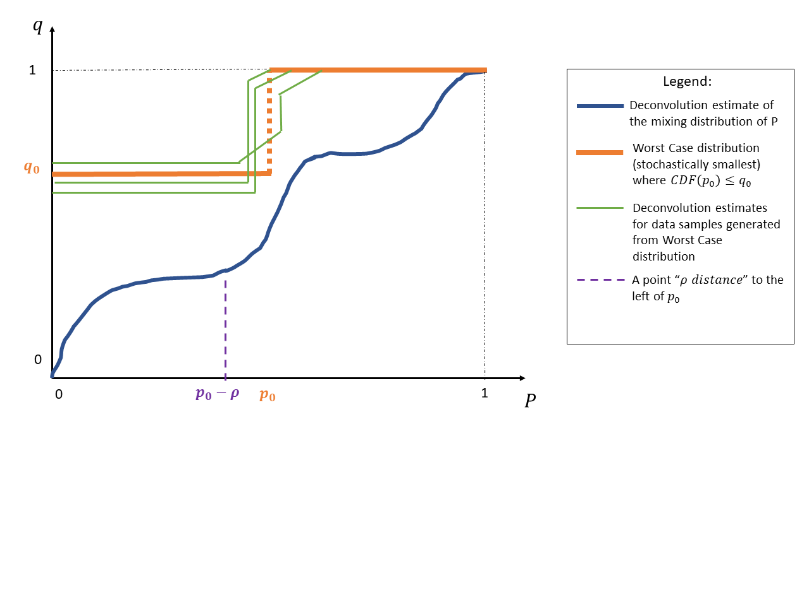
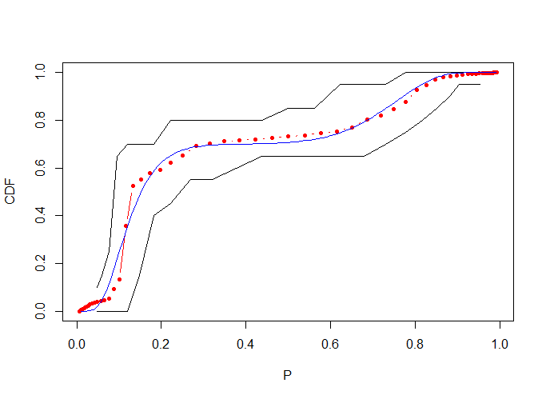
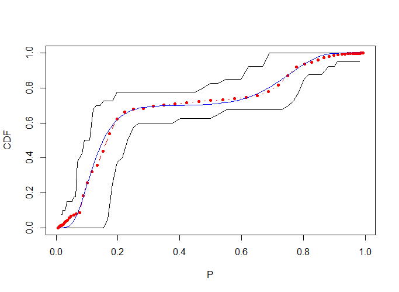

```{r setup, include=FALSE}
knitr::opts_chunk$set(echo = TRUE)
library(mcleod)
```

# Introduction

The `mcleod` package includes models for the mixing distribution of binomial and Poisson mixtures.
Specifically, let $X_i, i=1,...,n,$ denote $n$ binomial samples distributed via $X_i\sim bin(N_i,P_i)$, where the $N_i$'s are some known constants and the $P_i$'s are random variable from an unknown distribution. The `mcleod` package allows users to estimate the distribution of $P_i$'s and construct confidence intervals for its quantiles and CDF values. For the Poisson case, the mixing distribution is modeled using $X_i\sim Pois(\lambda_i)$, where the $\lambda_i$'s are drawn from an unknown distribution estimated from the data. 

In addition, the package allows users to fit a random intercept model of the following form: $X_i\sim bin(N_i,P_i)$ ; $log(P_i/(1-P_i)) = \gamma_i +\vec{\beta}^T \vec{Z}_i$, where $\gamma_i$ is an intercept term drawn from general distribution, whose CDF is estimated from the data, $\vec{Z}_i$ is a vector of sample covariates, and $\vec{\beta}$ is a vector of slope coefficients, also estiamted from the data. For the Poisson case, the mcleod package allows for the following model: $X_i\sim Pois(\lambda_i)$; $log(\lambda_i) = \gamma_i +\vec{\beta}^T \vec{Z}_i$.

The document is structured as follows. In Section 2 we introducing the generative model for the setting with no covariates, and briefly discuss how the estimation procedure for the mixing distribution. In Section 3 we show how point estimates for the CDF of the mixing distribution can be obtained using the package. In Section 4 we briefly discuss how confidence intervals for the quantiles and percentiles of the mixing distribution are constructed and show several code examples. In Section 5 we discuss the different random intercept models implemented in the `mcleod` package and provide example for fitting those models to data. In Section 5 we discuss some advances topics.

# The generative model
   We present the approach for modeling the mixing distribution in the binomial case, where $X_i\sim bin(N_i,P_i)$ and $P_i$ is a random variable. The approach for modeling Poisson samples is similar, and involves modeling $log(\lambda_i)$ as a random sample from the modeled presented below.
   
   Let $\gamma_i \equiv log(P_i/(1-P_i))$. Since the $P_i$'s are not observed (only indirectly through the $X_i$'s), we use a heirarhical Bayesian approach for modeling the distribution from which $P_i$'s are drawn. Let $I$ be some complete power of $2$, e.g., 32 or 64. Let $\vec{a}=(a_0,a_1,...,a_I), a_0<a_1<...<a_I,$ be a vector with $I+1$ entries marking $I+1$ partitioning point on the real line. We approximate the density function for the distribution of $\gamma_i$'s using a piece-wise constant density function, with "jumps" at the $I-1$ internal points of $\vec{a}$. This density function is characterized by $I$ unique function values, which we will denote using the vector $\vec{\pi}=(\pi_1,\pi_2,...,\pi_I)$. The conditional density function of $\gamma_i$'s $\vec{\pi}$ is given by:
    $$f_{\gamma|\pi}(u) = \pi_1\cdot \frac{\mathbb{1}_{[a_0,a_1)}\left(u\right)}{a_1-a_0} + ... + \pi_I\cdot \frac{\mathbb{1}_{[a_{I-1},a_I]}\left(u\right)}{a_I-a_{I-1}},$$ 
   where $\mathbb{1}_{[a_0,a_1)}(u)$ is the indicator function, receiving the value $1$ if $u$ is in the interval $[a_0,a_1)$. In order to estiamte the parameter vector $\vec{\pi}$, we assume a Polya tree prior: we assume $I-1$ Beta random variables are positioned in a binary tree-like hierarchy, and that the values of $\vec{\pi}$ are formed by multiplying the values Beta random variables in the paths formed by the tree, as explained in Figure 1. As a default choice we assume all Beta random variables in the Polya tree are $Beta(1,1)$, however, other hyper-parameter choices are also supported by the package, see additional details in Section 6.
   
The function $f_{\gamma|\pi}$ is estimated by sampling vectors from the posterior distribution of $\vec{\pi}|\vec{X}$ using an MCMC algorithm breifly described in Section 1.1.  We finish this section with two important notes:

(1) It is assumed that $N_i$ and $P_i$ are independent.

(2) The `mcleod` package also supports a second type of prior for $\vec{\pi}$, called a Dirichlet tree prior. The Dirichlet tree prior assumes the values of $\pi$ are formed by a two layer tree with the following structure: the root of the tree is associated with a Dirichlet random variable with $I_1$ components. Each of the components corresponds with a child node (in the second layer of the tree), which in turn, is associated with a Dirichlet random variable with $I_2$ components. Overall, the tree has $I=I_1\cdot I_2$ leaves, associated with $I$ entries in the vector $\vec{\pi}$. The probability vector $\vec{\pi}$ for this model is formed by multipling the values of Dirichlet vector components, as descending down the tree, in manner similar to Figure 1. The MCMC algorithm for estimating $\vec{\pi}$ for this type of prior is similar to the one presented in Section 1.1.
   
   
   
## Sampling from the posterior distribution
   The MCMC algorithm used for sampling from the posterior distribution of $\vec{\pi}$ can be breifly explained as follows:
   (1) Given $\vec{\pi}=\vec{v}$, one can draw a sample from the posterior distribution of $\gamma_i|X_i=x_i,\vec{\pi}=\vec{v}$.
   (2) Similarly, given the values of $\gamma_i$'s, one can draw of sample from the posterior distribution of $\vec{\pi}|\vec{\gamma},\vec{X}$, where $\vec{\gamma},\vec{X}$ are the samples for $\gamma_i$'s and $X_i$'s, respectively.
   (3) In the $i$th iteration, the MCMC algorithm samples values for the $\gamma_i$'s (using (1), and based on the algorithm current idea of $\vec{\pi}$). Next, using the $\gamma_i$'s sampled (and the posterior distribution of (2)), the algorithm samples a new value for $\vec{\pi}$. This process is performed iteratively, in order to receive an MCMC set of samples for both $\vec{\pi}$ and the $\gamma_i$'s. 
   
In order to obtain an estimator for $\vec{\pi}$ (and $f_{\gamma|\pi}$), we run the MCMC sampler for a large number of iterations, e.g., 500 or 1000, and estimate $\vec{\pi}$ using the empirical mean of the obtained samples. "Burn-in" samples from the start of the chain, usually 200-300 sampels, are disregarded when computing the estimate for $\vec{\pi}$.

# Deconvolution estimates
 In this section we present code examples showing how to estimate the mixing distribution in various cases.
 
## Deconvolution for binomial errors

We generate 300 samples, with $X_i\sim bin(30,P_i),$ and $log(P_i/(1-P_i))$ sampled from a mixture $0.5\cdot N(-1,0.3^2) + 0.5\cdot N(2,0.3^2)$.
```{r,cache=TRUE,eval=FALSE}
N = 30
K = 300
set.seed(1)
u = sample(c(0,1),size = K,replace = T)
x = rbinom(K,size = N,prob =inv.log.odds(rnorm(K,-1+3*u,sd = 0.3)))
n = rep(N,K)
head(cbind(x,n))
```

The simplest was to obtain deconvolution estimates is to run the function `mcleod`, receiving the $X_i$'s and $N_i$'s:
```{r,cache=TRUE,eval=FALSE}
res = mcleod(x, n)
```

The posterior samples for $\vec{\pi}$ can be obtained using the following entry `res$additional$original_stat_res$pi_smp`. The matrix has $I$ rows, corresponding to the segents of the prior distribution, and columns corresponding the MCMC iterations. For example, the CDF for the 100th MCMC sample for $\vec{\pi}$ can be obtained via:
```{r,cache=TRUE,eval=FALSE}
iter_number = 100

plot(res$parameters_list$a.vec, #the X axis is the series of breaks defined by \vec{a}
     c(0,cumsum(res$additional$original_stat_res$pi_smp[,iter_number])) #Y is the cumulative probability: starts at zero, and sums over the values of \vec{\pi} for the different segments
     , type = 'l' )
```
We can plot the posterior means of the CDF of the mixing distribution, along with a point cloud for the distribution of samples, using the following command:

```{r,cache=TRUE,eval=FALSE}
plot.posterior(res)
```
  
We proceed to show how various parameters can be changed. We can change the limits for $\vec{a}$ using the argument `a.limits`:
```{r,cache=TRUE,eval=FALSE}
res = mcleod(x, n, a.limits = c(-5,5))
```

We can change the prior and hyperparameters for the mixing distribution by constructing an object using `mcleod.prior.parameters`, and passing it as an argument to `prior_parameters`. For example, here we consruct a finer estimate of the mixing distribution, using a tree with $6$ layers.
```{r,cache=TRUE,eval=FALSE}
prior_obj  = mcleod.prior.parameters( #construct object defining the prior
  prior.type =MCLEOD.PRIOR.TYPE.BETA.HEIRARCHICAL, #type of prior
  Beta.Heirarchical.Levels = 6
  )

res = mcleod(x, n, prior_parameters = prior_obj) #pass object to main function as argument
```

Another type of prior is the two layer dirichlet tree. This prior requires the number of intervals (corresponding to leaves), and the number of nodes in the first layer.The prior can be defined using the following function:

```{r,cache=TRUE,eval=FALSE}
prior_obj  = mcleod.prior.parameters(
  prior.type =MCLEOD.PRIOR.TYPE.TWO.LAYER.DIRICHLET, # define a 2-layer Dirichlet tree
  Two.Layer.Dirichlet.Intervals = 64, #number of segments
  Two.Layer.Dirichlet.Nodes.in.First.Layer = 8 # Intervals must be integer multiple of this number
  )

res = mcleod(x, n, prior_parameters = prior_obj) #pass as argument
```

We can change the number of MCMC iterations, together with the number of iterations taken as "burn-in" period, using the function `mcleod.computational.parameters`:
```{r,cache=TRUE,eval=FALSE}
comp_obj = mcleod.computational.parameters(nr.gibbs = 500, #define the number of iter.s
                                             nr.gibbs.burnin = 250) 

res = mcleod(x, n, computational_parameters = comp_obj) # pass object as argument
```

## Deconvolution for Poisson errors
We show to estimate the mixing distribution when the data is sampled using a Poisson distribution. In our example $\log(\lambda_i)$ is distributed via a mixture of two normal components: $0.5*N(2,0.5^2) + 0.5*N(5,0.5^2)$. 

```{r,cache=TRUE,eval=FALSE}

  K = 200 # number of samples
  set.seed(1)
  #u sets right or left component in the mix. dist. for each obs.:
  u = sample(c(0,1),size = K,replace = T) 
  x = rpois(K,lambda = exp(rnorm(K,2 + 3*u,0.5)) ) #sample the obs
  
```

For Poisson distributed data, we run the `mcleod` function with `n.smp` set to `NULL`, and setting  `Noise_Type` to `MCLEOD.POISSON.ERRORS`. Other than that, parameters may be passed to `computational_parameters` and `prior_parameters` as in the previous examples. The following example also plots the posterior distribution.

```{r,cache=TRUE,eval=FALSE}
  res = mcleod(x, n.smp = NULL,a.limits = c(-2,8),Noise_Type = MCLEOD.POISSON.ERRORS)
  
  plot.posterior(res)
```

# Constructing confidence intervals for the CDF of rate parameters
This section explains how to construct point-wise confidence intervals for the CDF of the posterior distribution of $P_i$'s, given the data. We begin by briefly explaining the method, and then proceed to show code snippets explaining how the computation is done in practice.

## Method

Let $CDF(p)$ be the CDF value for the mixing distribution at point $p$, $p\in (0,1)$. In order to construct CIs for $CDF(p)$, we invert test for the following types of hypotheses:

 $$H_0^{LE}(\tilde{q},\tilde{q}): \tilde{q} \le CDF(\tilde{p})$$
 
 $$H_0^{GE}(\tilde{q},\tilde{p}): CDF(\tilde{p}) \le \tilde{q}$$
 
 Specifically, when constructing a two-sided confidence interval at level $1-\alpha$ for $CDF(\tilde{p})$, in order to find the lower end of the CI, we find the the highest $\tilde{q}$ for which we do not reject the null hypothesis $H_0^{GE}(\tilde{q},\tilde{p})$ at level $\alpha/2$. Similarly, the upper end of the CI is found by the finding the lowest $\tilde{q}$ for which we do not reject $H_0^{LE}(\tilde{q},\tilde{p})$ at level $\alpha/2$. 

We proceed to explain how the hypotheses $H_0^{GE}(\tilde{q},\tilde{p})$ and $H_0^{LE}(\tilde{q},\tilde{p})$ are tested. Since the procedures for the two hypotheses are similar, we describe the procedure for $H_0^{GE}(\tilde{q},\tilde{p})$ alone. Throughout the explanation we make use of Figure~2. Let $\hat{CDF}(p)$ denote an estimator for $CDF(p)$, computed using the point-wise median at each value of $p$. This estimator is represented in Figure 2 by the blue curve. In order to test $H_0^{GE}(q,p)$, we compare the function $\hat{CDF}(p)$ for the data with similar deconvolution estimates, obtained for a distribution for which the null hypothesis. Specifically, our valid test for $H_0^{GE}(\tilde{q},\tilde{p})$ would compare $\hat{CDF}$ with estimates obtained from data samples, generated from the sthocastically smallest distribution for which $H_0^{GE}(\tilde{q},\tilde{p})$ holds. This distribution has $\tilde{q}$ mass at $p=0$ and a mass of $1-\tilde{q}$ at $p=\tilde{p}$, and is represented by the orange curve in Figure 2.

The step for testing $H_0^{GE}(\tilde{q},\tilde{p})$ are as follows:
(1) Estimate $\hat{CDF}(p)$ for the data.

(2) Sample $B$ data sets of the form $X_i\sim bin(N_i,P_i), i\in\{1,...,n\}$, where the $N_i$'s are identical to the values for the observed data, and the $P_i$'s are sampled independently from a distribution with $\tilde{q}$ mass at $p=0$ and a mass of $1-\tilde{q}$ at $p=\tilde{p}$. For each of the $B$ data generations, estimate the mixing distribution. Let $\hat{CDF}^{(b)}(p), b\in\{1,...,b\}$ denote the estimated CDFs for the observed dataset. A graphical depiction of the estimated CDFs for the generated samples is shown using the green curves in Figure 2.

(3) Compute a $P$-value using the following formula:
    $$ PV = \frac{1+\sum_{b=1}^{B} I\left(\hat{CDF}(\tilde{p}-\rho) \le \hat{CDF}^{(b)}(\tilde{p}-\rho) \right)}{1+B}, $$
    where $\rho$ is a parameter of the method, see additional figures below. The PV can be interpreted as counting the relative portion of green curves that are found above the blue curve, at point $\tilde{p}-\rho$ (shown in purple in Figure 2). In Figure 2, we have $B=3$ green curves found above the blue curve, so we know the $PV$ is $\frac{1+3}{1+3}$ or $1$.

Yekutieli et al. (2022) discuss the importance of the parameter rho: they show that by testing GE hypotheses by taking the values of CDF estimates at $\tilde{p}-\rho$ instead of $\tilde{p}$, the test potentially has higher power, if $\rho$ is calibrated correctly. The authors suggest the following calibratio procedure for $\rho$: (1) pick, at random, 10\%-20\% of the samples, and exclude them from the data used for testing; (2) Let $p_1,p_2,...,p_m$ be a series of values in the range $(0,1)$. In addition, let $\rho_1,\rho_2,...,\rho_T$ be a set of $T$ candidate values for $\rho$. Constructing CIs for $CDF(p_1),CDF(p_2),..., CDF(p_m)$ using each of the $T$ values for $rho$. Let $LengthCI(p_i,\rho_j)$ denote the length of the CI for $CDF(p_i)$, when statistical testing is done using $\rho_j$. (3) The authors suggest selecting $\rho$ using: 
$$\rho = arg\,\, min_{\rho \in \{\rho_1,\rho_2,...,\rho_T\}} \sum_{i=1}^{m} LengthCI(p_i,\rho).$$

The authors suggest selecting the values $p_1,p_2,...,p_T$ to be the quantiles for which the estimated CDF for mixing distribution in the holdout data obtains the values $0.1,0.2,...,0.9$. In addition, the package also include default values for $\rho_1,\rho_2,...,\rho_T$. See additional details in the on the calibration method for $\rho$ in the manuscript.




When testing $H_0^{LE}(\tilde{q},\tilde{q})$ hypotheses, there are two differences: (1) bootstrap samples are generated using a mixing distribution with $\tilde{q}$ mass at $p=\tilde{p}$ and a mass of $1-\tilde{q}$ at $p=1$; (2) testing is done at the quantile $\tilde{p}+\rho$; and (3) Pvalues are computed using a left tailed rejection region, i.e., by checking the proportion of 
$\hat{CDF}^{(b)}(\tilde{p}+\rho)$'s smaller than $\hat{CDF}(\tilde{p}+\rho)$.


### Speeding up computations

The above method is computationally intensive, however there are several steps taken to speed up computation:
* Computation of $P$-values is done parallely, using `R` package `doRNG`. The number of cores used can be set by the user.

* When computing $P$-values, if the first $\alpha\cdot B$ permutations are more extreme than oberserved test statistic, the computation is halted and a PV of 1 is returned.

* Let $p,p'$ be two quantiles of the mixing distribution, with $p<p'$. Due to the monotonicty of the CDF of the mixing distribution, it is unknown that the lower end of the CI for $CDF(p')$ is greater than or equal to the lower end of the CI for $CDF(p)$. The upper ends of the CIs share the same relationship. Therefore, if $H_0^{GE}(q,p)$ was rejected at significance level $\alpha$, we need not test $H_0^{GE}(q,p')$, and can proceed directly to testing CDF values higher than $q$.

* The code only needs to generate bootstrap samples for $H_0^{GE}(q,p)$. Bootstrap samples for $H_0^{LE}(q,p)$ are obtained without additional computation using the following "hack": Let $\theta=log(p/(1-p))$ denote the log-odds for $p$. Let $\hat{CDF}(\theta)$ denote a CDF estimate parameterized using the parameter $theta$ (i.e., $\hat{CDF}\left(\frac{exp(p)}{1+exp(p)}\right)$ ). If $\hat{CDF}(\theta)$ is a deconvolution estimate for a sample from the worst case (stochastically lowest) distribution of $H_0^{GE}(q,p)$, then $\hat{CDF}(-\theta)$ is equivalent to a deconvolution estimate for a sample from the worst case (stochastically highest) distribution of $H_0^{GE}(1-q,1-p)$. See additional details in paper and the internal function `mcleod:::mcleod.CI.deconv.bank.get_median_curves_for_worst_case_hypothesis_at_point`.

* We testing $H_0^{GE}(q,p)$, a lower bound for the $P$-value is given by $F_{bin(n,q)}(n\cdot \hat{CDF}(p-\rho))$, where $F_{bin(n,q)}$ is the CDF of a binomial random variable with $n$ draws and probability $q$ for success in each draw. Similarly, for $H_0^{LE}(q,p)$, a lower bound for the $P$-value is given by $F_{bin(n,1-q)}(n\cdot (1-\hat{CDF}(p-\rho)))$. The code checks if the lower bound for the $P$-value is greater than $\alpha/2$. If this is the case, we do not need to perform permutations. See additional details on how this bound was derived in the paper.

## Pointwise Confidence intervals for CDF, binomial noise
For the example, we 500 binomially distributed samples with $X_i\sim bin(20,P_i)$, and $log(P_i/(1-P_i))$ distributed according to a bi-normal mixture: $log(P_i/(1-P_i)) \sim 0.5\cdot N(-2,0.5^2) + 0.5 \cdot N(-1,0.3^2)$.


```{r,cache=TRUE,eval=FALSE}

  n = 500
  N = rep(20,n) 
    set.seed(1)
  p = inv.log.odds(rnorm(n,-2,0.5)+3*rbinom(n,1,0.3))
  
  X = rbinom(n = n,size = N,prob = p)
  
   # we obtain the true distribution $P_i$'s by sampling 10^6 observations,
   # later used for plottin
  p_true = inv.log.odds(rnorm(1E6,-2,0.5)+3*rbinom(1E6,1,0.3))
  

```

Confidence intervals for the CDF, across all values of $\theta = log(P_i/(1-P_i))$, are estimated via the following functions. The code takes a few minutes to run, and prints progress to screen. This can be changed by setting `verbose` to `F`. For this run, we use all the data for testing, and use a fixed value of $\rho=0.25$. Calibration of $\rho$ will be discussed in the next examples.

```{r,cache=TRUE,eval=FALSE}

CI.est.res = mcleod.estimate.CI(X = X, N = N,
        CI_param = mcleod.CI.estimation.parameters(rho.set.value = 0.25))

```

Next, we plot the estimated CDF in red (posterior median), the pointwise confidence intervals in black, and the true mixing distribution in blue.
```{r,cache=TRUE,eval=FALSE}

plot.mcleod.CI(mcleod.CI.obj = CI.est.res) #one command to plots CIs

# plots the oracle:  
oracle_x = seq(0.01,0.99,0.01) 
lines(oracle_x,(ecdf(p_true))(oracle_x),col = 'blue',lwd =1.5)

```

The above code snippet was run before-hand, and the result is displayed here as a figure:



The exact values for the CI can be extracted via:

```{r,cache=TRUE,eval=FALSE}

dt_CIs = data.frame(
  log.odds = CI.est.res$bank$CI_param$theta_vec,
  Lower = CI.est.res$computed_curves$q_star_GE,
  Upper = CI.est.res$computed_curves$q_star_LE 
)

dt_CIs

```

We move to a more advanced example, showing how (a) $\rho$ can be estimated from the data, (b) how to refine the grid of quantiles and CDF values, over which CIs are constructed, and (c) how to change to confidence level for the CIs.


```{r,cache=TRUE,eval=FALSE}

  # We construct a CI object holding the different definitions
  CI_param = mcleod.CI.estimation.parameters(
    # grid of mixing distribution quantiles. Here we work with 0.1 steps, instead of 0.25
    theta_vec = seq(-4,4,0.1),
    # grid of CDF values. Previous grid has 0.05 jumps
    q_vec = seq(0.05,0.95,0.025),
    # We change the confidence level to 0.9 (instead of the default 95% CI)
    alpha.CI = 0.9,
    # we consider 0.1,0.2,0.3 as possible values for rho
    rho.possible.values = seq(0.1,0.3,0.1))
  
  # we pass CI_param as an object, and also set the 
  # relative part of samples used for calibrating rho
  # here we pick 10% of the data. Values in the range 0.1-0.2 are reasonable
  CI.est.res = mcleod.estimate.CI(X = X,
                                  N = N,
                                  CI_param = CI_param,
                                  ratio_holdout = 0.1)

```

Running the code with the following parameters leads to finer CI:s



## Computationally efficient confidence intervals for the quantile of the mixing distribution that corresponds to a given CDF value

The function `mcleod.estimate.CI.single.q` is appropriate for cases where a single confidence interval for a given CDF value is needed.  The function receives the data, toghether with a given CDF value, e.g. `q=0.5` for the median. The function outputs a confidence interval, in terms of quantiles (values of $\theta$) for the given CDF value.

The following code snippet computes a CI for the median of the mixing distribution. In this code snippet, we choose a resolution of $0.05$ for the reported confidence interval. Calibration of $\rho$ is done automatically using 10% of the data. Using a fixed value for $\rho$ reduces the running time by about 50%.

```{r,cache=TRUE,eval=FALSE}
  
  set.seed(1)
  
  CI.res = mcleod.estimate.CI.single.q(X = X,N = N,q = 0.5, #the wanted CDF value
     #set resolution:
   CI_param = mcleod.CI.estimation.parameters(theta_vec = seq(-3,3,0.05)), 
           verbose = F) # can ask to print progress. Takes around 2 minutes.
  
  CI.res
  
```

## Computationally efficient confidence intervals for the CDF value of the mixing distribution at a given quantile


The function `mcleod.estimate.CI.single.theta` is appropriate for cases where a single confidence interval for a given $\theta$ value is needed.  The function receives the data, toghether with a quantile, and outputs a confidence interval, in terms of CDF values.

The following code snippet computes a CI for the CDF value of the mixing distribution, at the quantile $\theta = 0.5$. Calibration of $\rho$ is done automatically using 10% of the data. Using a fixed value for $\rho$ reduces the running time by about 50%.

```{r,cache=TRUE,eval=FALSE}

  CI.res = mcleod.estimate.CI.single.theta(X = X, N = N,
    # the quantile for which the CI is needed
    theta = 0,
    # resolution for the CI, in terms of CDF values
    CI_param = mcleod.CI.estimation.parameters(q_vec = seq(0.05,0.95,0.01)) )

  CI.res
  
```

## How to compute point-wise confidence intervals for multiple confidence levels simultanously

Users may need $P$-values for $H_0^{LE}(\tilde{q},\tilde{q})$ and $H_0^{GE}(\tilde{q},\tilde{q})$ across all values of $\tilde{q}$'s and $\tilde{q}$'s. For example, when wanting to derive all point-wise confidence intervals, for all confidence levels, simultanously. The following code snippet explains how to generate $P$-values for all hypotheses simultanously.

```{r,cache=TRUE,eval=FALSE}

#Generate a similar dataset, 200 samples
n = 200
N = rep(20,n) 
  set.seed(1)
p = inv.log.odds(rnorm(n,-2,0.5)+3*rbinom(n,1,0.3))
X = rbinom(n = n,size = N,prob = p)

# We call mcleod.estimate.CI again, but 
CI.est.res = mcleod.estimate.CI(X = X, N = N,
        # turn this flag to true
        compute_P_values_over_grid = T,
        # and this flag to false
        compute_CI_curves = F,
        # for this example, we use a fixed value of rho=0.25
        CI_param = mcleod.CI.estimation.parameters(rho.set.value = 0.25),
        # this can be used to print progress
        verbose = T)

```


The Pvalues for all GE/LE hypotheses are found in the following fields of the returned object:

```{r,cache=TRUE,eval=FALSE}
# Grid of P-values for GE hypotheses. Rows are CDF values, cols are quantiles.
# See rownames and colnames for details.
CI.est.res$pvalues_grid$GE.pval.grid

# Grid of P-values for LE hypotheses. Rows are CDF values, cols are quantiles.
# See rownames and colnames for details.
CI.est.res$pvalues_grid$LE.pval.grid

```


# GLMs with a random effect intercept of a general distribution
This section discusses models of the form $X_i\sim bin(N_i,P_i)$, where $P_i$ follows the hierarchical model $log(P_i/(1-P_i))=\gamma_i + \vec{\beta}^T \vec{Z}_i$, and where $\gamma_i$ is sampled from the Polya-tree framework of Figure 1, $\vec{\beta}$ is a vector of $p$ slopes, and $\vec{Z}_i$ is a vector of sample covariates (with no intercept term).

In order to introduce covariates into the model, we assume $\vec{\beta}$ is distributed $\vec{\beta}\sim N(\vec{0},\Sigma)$, where $\Sigma$ is a diagonal matrix with entries defined by the user. By default, $\Sigma$ is set to be the unit matrix. In addition to a multivariate normal prior, our code also supports: (1) non-informative priors for slope coefficients, by setting diagona entries of $\Sigma$ to negative values: (2) Priors of a general distribution, see example below.
      
Covariates are incorporated into the MCMC algorithm using a Metropolis-Hastings step: At the first iteration, the algorithm samples values for $\vec{\beta}$, and $\vec{\pi}$. In each iteration, the algorithm first samples values for the $\gamma_i$'s given $\vec{\pi}$ and $\vec{\delta}$. Afterwards the algorithm samples values for $\vec{\pi}$ and $\vec{\beta}$ given the value of the $\gamma_i$'s, to be used in the next iteration. The value for $\vec{\pi}$ is sampled using a Gibbs sampling step, as in the setting with no covariates. The value of $\vec{\beta}$ is sampled using a Metropolis-Hastings step and the proposal distribution $N(\vec{\beta}',\Sigma_{Proposal})$, where $\vec{\beta}'$ is the vector of slopes for the current iteration, and $\Sigma_{Proposal}$ is a diagonal matrix (the default matrix has the value $0.05$ across all diagonal entries). In order for the proposal. Generally, it is best to initialize the coefficients vector $\vec{\beta}$ using Binomial regression, see example below.

In additional to the Binomial model, the package also supports a Poisson regression model of the form $X_i\sim Pois(\lambda_i), log(\lambda_i)\sim \gamma_i + \vec{\beta}^T \vec{Z}_i$, see example below. In addition, our code supports offset terms (covariates with a slope fixed to 1).

The model assumes $N_i, \vec{Z_i}$, and $\gamma_i$ are jointly independent.
      
## Binomial regression with a general random intercept

### Example 1: Coefficients intialized at 0

```{r,cache=TRUE,eval=FALSE}
N = 30
K = 200
set.seed(1)
covariates = matrix(rnorm(K*2,sd = 0.5),nrow = K)
colnames(covariates) = c('covariate 1','covariate 2')
real_beta_1 = -1
real_beta_2 = 1
x = rbinom(K,size = N,
           prob = inv.log.odds(rcauchy(K,location = 0,scale = 0.5) +
                     real_beta_1*covariates[,1] + real_beta_2*covariates[,2]))
n = rep(N,K)

head(round(cbind(x,n,covariates),digits = 2))
```

```{r,cache=TRUE,eval=FALSE}
res = mcleod(x, n, covariates = covariates)
```

```{r,cache=TRUE,eval=FALSE}
coeffs = mcleod::results.covariate.coefficients.posterior(res)
```

```{r,cache=TRUE,eval=FALSE}
print(coeffs)
```

```{r,cache=TRUE,eval=FALSE}
plot.posterior(res)
```

### Example 2: Coefficients intialized by logistic regression, change priors for $\beta$s

```{r,cache=TRUE,eval=FALSE}
  N = 30
  K = 300
  set.seed(2)
  covariates = matrix(rexp(K),nrow = K)
  real_beta = -0.5
  
  u = sample(c(0,1),size = K,replace = T)
  
  x = rbinom(K,size = N,
           prob =inv.log.odds(rnorm(K,-1+3*u,sd = 0.3) +
                                real_beta*covariates))
  n = rep(N,K)
```

```{r,cache=TRUE,eval=FALSE}
  model_dt = data.frame(c = x,nc = n-x)
  model_dt = cbind(model_dt,covariates)
  model <- glm(cbind(c,nc) ~.,family=binomial,data=model_dt)
  model$coefficients[-1]
```

```{r,cache=TRUE,eval=FALSE}
  coeffs_obj  = mcleod.covariates.estimation.parameters(
                  beta_init = model$coefficients[-1],
                  beta_prior_sd = c(1.5))

  res = mcleod(x,
               n,
               covariates = covariates,
               covariates_estimation_parameters = coeffs_obj
               )
  
```


```{r,cache=TRUE,eval=FALSE}
coeffs = mcleod::results.covariate.coefficients.posterior(res,plot.posterior = F)
print(coeffs)
```

```{r,cache=TRUE,eval=FALSE}
plot.posterior(res)
```

## Poisson regression with a general random intercept and offset term
```{r,cache=TRUE,eval=FALSE}

   
  K = 200
  set.seed(2)
  covariates = matrix(rexp(K,rate = 2),nrow = K)
  real_beta = 0.5
  u = sample(c(0,1),size = K,replace = T)
  extrinsic_size = runif(n = K,1,100)
  offset = log(extrinsic_size)
  
  x = rpois(K,lambda = extrinsic_size * exp(rnorm(K,2 + 3*u,0.5) + real_beta* covariates) )
  
  
  comp_obj = mcleod.computational.parameters(nr.gibbs = 1000,nr.gibbs.burnin = 500)
  
  res = mcleod(x, n.smp = NULL,a.limits = c(-2,8),
               computational_parameters = comp_obj,
               covariates = covariates,
               Noise_Type = MCLEOD.POISSON.ERRORS,
               offset_vec = offset
               )
```

```{r,cache=TRUE,eval=FALSE}
mcleod::results.covariate.coefficients.posterior(res)

```

```{r,cache=TRUE,eval=FALSE}
plot.posterior(res)
```

## Setting the prior distributions on coefficient to be other than normal

```{r,cache=TRUE,eval=FALSE}
N = 30
K = 200
set.seed(1)
covariates = matrix(rnorm(K*2,sd = 0.5),nrow = K)
real_beta_1 = -1
real_beta_2 = 1
x = rbinom(K,size = N,prob = inv.log.odds(rnorm(K,0,sd = 1) + real_beta_1*covariates[,1] + real_beta_2*covariates[,2]))
n = rep(N,K)
```

```{r,cache=TRUE,eval=FALSE}
model_dt = data.frame(c = x,nc = n-x)
model_dt = cbind(model_dt,covariates)
model <- glm(cbind(c,nc) ~.,family=binomial,data=model_dt)
```


```{r, cache=TRUE,eval=FALSE}
beta_prior_points = seq(-5,5,0.01)

beta_prior_probs = pcauchy(beta_prior_points[-1]) - 
                  pcauchy(beta_prior_points[-length(beta_prior_points)])

beta_prior_probs = beta_prior_probs/ sum(beta_prior_probs)
  
```

```{r, cache=TRUE,eval=FALSE}
 plot(beta_prior_points[-1],beta_prior_probs,type = 'l',xlab = 'theta',ylab = 'probability in bin of beta_prior_probs')
```
 
```{r, cache=TRUE,eval=FALSE}
beta_prior_probs = matrix(c(beta_prior_probs, beta_prior_probs),ncol = 2)
```


```{r, cache=TRUE,eval=FALSE}
coeffs_obj = mcleod.covariates.estimation.parameters(
  beta_init = model$coefficients[-1],                                                                Manual_Prior_Values = beta_prior_points,                                                           Manual_Prior_Probs = beta_prior_probs)
```

```{r, cache=TRUE,eval=FALSE}
res = mcleod(x, n, covariates = covariates,
               covariates_estimation_parameters = coeffs_obj)
```
  
```{r, cache=TRUE,eval=FALSE}
mcleod::results.covariate.coefficients.posterior(res,plot.posterior = F)
```


# Additional topics

## Changing hyper-parameters for the priors of the mixing distribution:


```{r, cache=TRUE,eval=FALSE}

set.seed(1)

K = 2000 # Number of samples
n.vec = rep(2,K) #number of draws for each sample

# function for sampling a beta binomial (2,2)
generate_sample_Beta_2_2 = function(K){ 
  p.vec = rbeta(n = K,2,2)
  x.vec = rbinom(K,size = n.vec,p.vec)
  return(x.vec)
}

x.vec = generate_sample_Beta_2_2(K)

#run sampler:
mcleod_res = mcleod(x.vec,n.vec,a.limits = c(-4,4),exact.numeric.integration = T,
                    prior_param = mcleod.prior.parameters(prior.type = MCLEOD.PRIOR.TYPE.BETA.HEIRARCHICAL,Beta.Heirarchical.Levels = 5),
                    computational_parameters = mcleod.computational.parameters(nr.gibbs = 2000,nr.gibbs.burnin = 1000))

mcleod::plot.posterior(mcleod_res)

```

```{r, cache=TRUE,eval=FALSE}

#%%%%%%%%%%%%%%%%%%%%%%%%%%%%%%%%%%%%
#Example how to change hyper-parameters.
#%%%%%%%%%%%%%%%%%%%%%%%%%%%%%%%%%%%%
#For, example, how to change all hyper parameters to 2
# We form two matrices, for $\alpha^{L}$ and $\alpha^{U}$.
# In each matrix, the [l,i] entry gives the appropriate hyper parameter for the ith node on the lth level.

L = 5 # number of levels
alpha_L = matrix(NA,nrow = L,ncol = 2^(L-1)) # hyper-parameter matrices 
alpha_U = matrix(NA,nrow = L,ncol = 2^(L-1))

for(l in 1:L){
  for(k in 1:2^(l-1)){
    alpha_L[l,k] = 2
    alpha_U[l,k] = 2
  }
}

# we pass the hyper-paramers to the mcleod.prior.parameters(...) function
mcleod_res = mcleod(x.vec,n.vec,
                    a.limits = c(-4,4),
                    exact.numeric.integration = T,
                    prior_param = mcleod.prior.parameters(prior.type = MCLEOD.PRIOR.TYPE.BETA.HEIRARCHICAL,
                                                          Beta.Heirarchical.Levels = L,
                                                          Prior_Hyper_Parameters_BetaH_L = alpha_L,
                                                          Prior_Hyper_Parameters_BetaH_U = alpha_U),
                    computational_parameters = mcleod.computational.parameters(nr.gibbs = 2000,
                                                                               nr.gibbs.burnin = 1000)
                    )

mcleod::plot.posterior(mcleod_res)

```

```{r, cache=TRUE,eval=FALSE}


Nodes_in_first_layer = 8
Total_nr_nodes = 64

Two_Level_Dirichlet_Tree_Hyperparameters = matrix(NA,nrow = 2,ncol = Total_nr_nodes)

Two_Level_Dirichlet_Tree_Hyperparameters[1,1:Nodes_in_first_layer] = 2
Two_Level_Dirichlet_Tree_Hyperparameters[2,1:Total_nr_nodes] = 2

# we pass the hyper-paramers to the mcleod.prior.parameters(...) function
mcleod_res = mcleod(x.vec,n.vec,
    a.limits = c(-4,4),
    exact.numeric.integration = T,
    prior_param = mcleod.prior.parameters(prior.type = MCLEOD.PRIOR.TYPE.TWO.LAYER.DIRICHLET,
                              Two.Layer.Dirichlet.Intervals = Total_nr_nodes,
                              Two.Layer.Dirichlet.Nodes.in.First.Layer =  Nodes_in_first_layer,
                               Prior_Hyper_Parameters_2LDT = Two_Level_Dirichlet_Tree_Hyperparameters),
    computational_parameters = mcleod.computational.parameters(nr.gibbs = 2000,
                                                               nr.gibbs.burnin = 1000)
)

mcleod::plot.posterior(mcleod_res)

```
